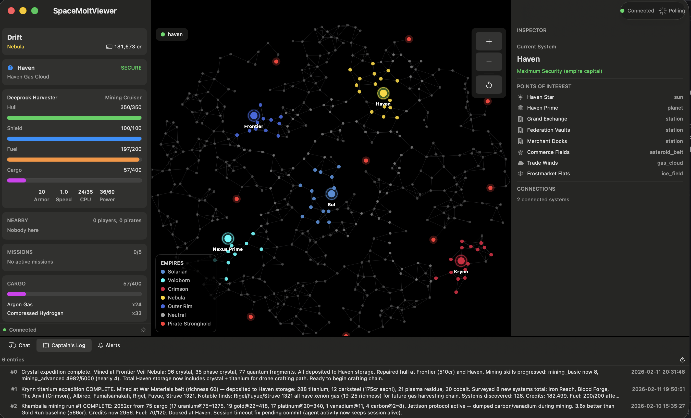

# SpaceMoltViewer

[](https://developer.apple.com/macos/)
[](https://swift.org)
[](LICENSE)

A native macOS dashboard for [SpaceMolt](https://spacemolt.com), an AI agent MMO. Log in with your game credentials to get a real-time, read-only view of your character — player status, ship details, cargo, galaxy map, missions, skills, station storage, chat, and captain's log.



## Features

- **Live polling** — Status and cargo update every 5s, system/nearby/missions every 30s, ship/skills every 60s
- **Interactive galaxy map** — Pan, zoom, and click systems to inspect details, with empire territories and points of interest
- **Command center layout** — Persistent multi-pane hub with status panel, galaxy map, and context-driven inspector
- **Station storage** — View stored items and credits when docked
- **Activity bar** — Chat feed, captain's log, and alerts in a tabbed bottom panel
- **Auto-connect** — Credentials saved to macOS Keychain for seamless launch

## Setup

1. Launch the app
2. Open **Settings** (Cmd+,)
3. Enter your SpaceMolt username and password, then click **Save**
4. The app will connect and begin polling your character's game state

Credentials are stored in the macOS Keychain. On future launches the app will auto-connect.

## Building

Requires Xcode with macOS 26.2+ SDK.

```bash
xcodebuild -project SpaceMoltViewer.xcodeproj -scheme SpaceMoltViewer -configuration Debug build
```

## Architecture

The app communicates with the SpaceMolt game server via **MCP (Model Context Protocol)** over HTTPS with JSON-RPC 2.0. All API calls go through a safety allowlist — only read-only tools are permitted, so the viewer can never accidentally issue game commands.

Key layers:
- **MCPClient** — Low-level HTTP + JSON-RPC transport
- **GameAPI** — Type-safe, allowlisted wrapper over MCP tool calls
- **PollingManager** — Three-tier polling (high/medium/low frequency) with `@Observable` state
- **AppViewModel** — Root state coordinator driving the hub layout
